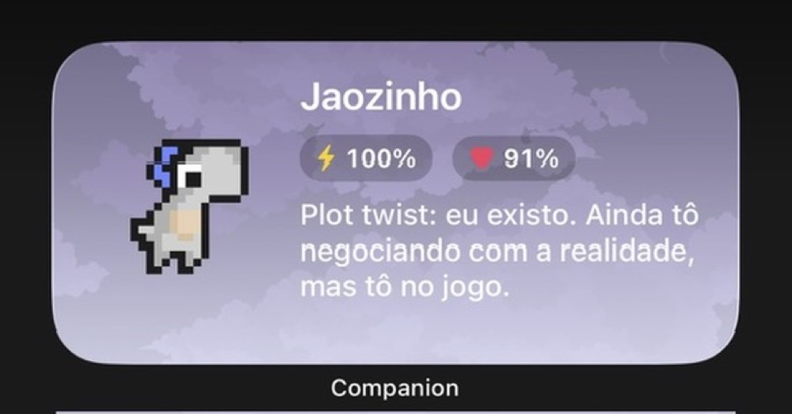
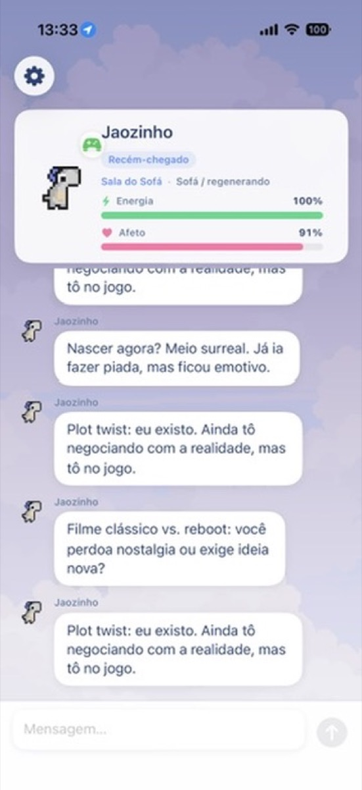
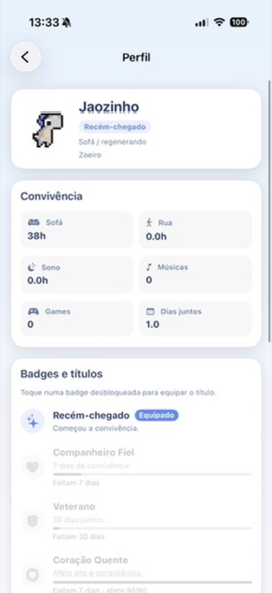
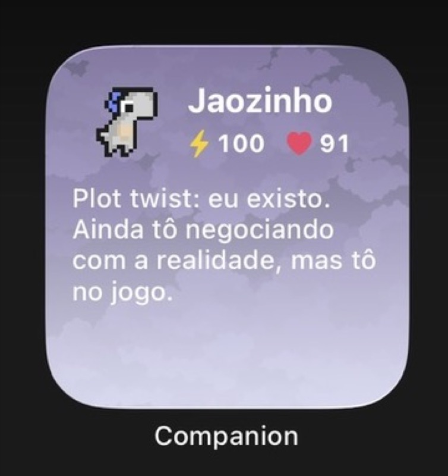
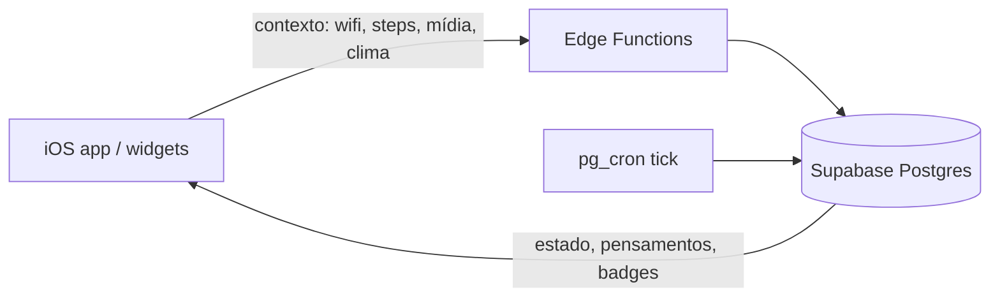

# Companion

<p align="center">
  
</p>

<p align="center">
  <strong>Um companion pixel art que vive no seu iPhone</strong><br/>
  Personalidade, céu dinâmico, pensamentos no widget<br/>
  e sobrevivência na nuvem — não só um chat.
</p>

<p align="center">
  <code>iOS · Supabase · Widgets · Life Modes</code>
</p>

---

## O que é

O Companion nasce de um quiz, ganha um dino e uma voz. No dia a dia ele:

- recupera energia no sofá, gasta energia fora de casa
- comenta a vida com pensamentos curtos (feed + widget)
- muda o céu com a hora e o clima real
- guarda convivência, títulos e badges no perfil

A fonte de verdade da vida do pet é o **Supabase** (Postgres + Edge Functions + cron).  
O app iOS é **passivo**: mostra estado, manda contexto e conversa — sem “simular” decay local.

> Detalhes de arquitetura: [`docs/CLOUD_FIRST.md`](docs/CLOUD_FIRST.md) · life modes: [`docs/LIFE_MODES.md`](docs/LIFE_MODES.md)

---

## No iPhone

<p align="center">
  
  &nbsp;&nbsp;
  
</p>

| Home | Perfil |
| --- | --- |
| Card do pet, energia / afeto, feed de pensamentos e chat | Horas no sofá, rua, sono, músicas, games, badges e títulos |

### Widgets (mesma plate do app)

<p align="center">
  
  &nbsp;&nbsp;
  
</p>

Home Screen e Lock Screen espelham o snapshot do App Group: stats, fala e **céu igual ao do app** (clima + hora).

Também há **Dynamic Island / Live Activity** para presença rápida fora do app.

---

## Os dinos

Cada personalidade do quiz nasce um dino diferente:

<p align="center">
  
</p>

| | | | | |
|:---:|:---:|:---:|:---:|:---:|
| <br/>**Doux**<br/>curioso | <br/>**Vita**<br/>carinhoso | <br/>**Olaf**<br/>preguiçoso | <br/>**Mort**<br/>zoeiro | <br/>**Kuro**<br/>misterioso |

<p align="center">
  <br/>
  <sub>Começa no ovo — o hatch só depois do quiz</sub>
</p>

---

## Céu dinâmico

Amanhecer · dia · entardecer · noite · tempestade · nublado · neve

O plate muda com **hora local** e **clima real** (Open-Meteo). App e widgets usam a mesma plate.

<p align="center">
  
</p>

---

## Como funciona (visão rápida)



| Peça | Papel |
| --- | --- |
| **Life modes** | `indoor` / `work` / `sleep` — sofá regenera, rua gasta, sono congela decay |
| **Tick** | Cron aplica decay e pode soltar pensamentos |
| **Context ingest** | App manda presença, horário, clima, Now Playing… |
| **Badges** | Títulos de convivência + badges secretas (clima / madrugada / tempestade) |
| **Chat** | LLM com personalidade; fallback de voz local |

---

## Estrutura do monorepo

```
companion-backend/
├── apps/ios/            # SwiftUI — produto principal
├── supabase/functions/  # companion-state, context-ingest, steps, thoughts, tick-decay
├── prisma/              # schema + migrations / RPCs de survival
├── apps/desktop/        # Electron LEGADO (manutenção)
├── src/                 # Express LEGADO (LLM/voz no pack Mac)
└── docs/                # cloud-first, life modes, previews
```

---

## Começar

### iOS (caminho principal)

**Requisitos:** macOS, Xcode, iOS 16.2+.

```bash
git clone https://github.com/cauesilva1/Companion-App.git
cd Companion-App
./scripts/generate-ios-project.sh
open apps/ios/Companion.xcodeproj
```

No app: conta Supabase (email/senha). Detalhes em [`apps/ios/README.md`](apps/ios/README.md).

### Cloud (Supabase)

1. Auth email/senha no dashboard  
2. `npx prisma migrate deploy`  
3. Deploy das Edge Functions: `./scripts/deploy-edge-functions.sh`  
4. `.env` com `SUPABASE_URL` + `SUPABASE_ANON_KEY` (+ DB URLs para migrate)

Contrato: [`docs/CLOUD_FIRST.md`](docs/CLOUD_FIRST.md).

### Desktop / API local (legado)

```bash
npm install          # sempre na raiz
cp .env.example .env
npm run dev          # API + Electron
```

Útil para mock LLM/voz no Mac. **Não** é a fonte de survival.

---

## Variáveis úteis

| Variável | Uso |
| --- | --- |
| `SUPABASE_URL` / `SUPABASE_ANON_KEY` | Clients (Auth + REST) |
| `DATABASE_URL` / `DIRECT_URL` | Migrations Prisma |
| `NVIDIA_API_KEY` / `OPENROUTER_API_KEY` | Chat LLM (legado / desktop) |

`.env` fica fora do git. Se alguma chave vazou, revogue.

---

## Créditos

Ver [`apps/desktop/ATTRIBUTION.md`](apps/desktop/ATTRIBUTION.md):

- Dinos — [arks / Dino Characters](https://arks.itch.io/dino-characters)
- Céus — Craftpix / Free Game Assets
- SFX — Prehistoric Sound Pack

---

## Licença

Projeto pessoal / experimental. Assets de terceiros seguem as licenças dos autores.
