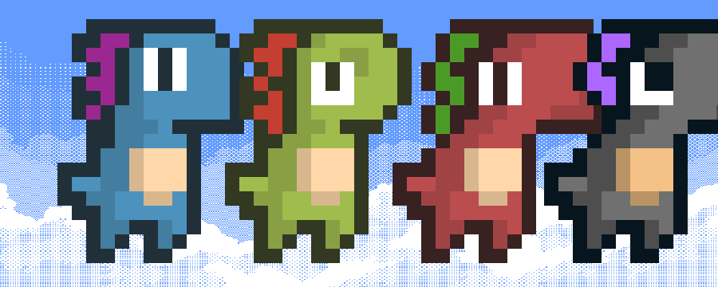
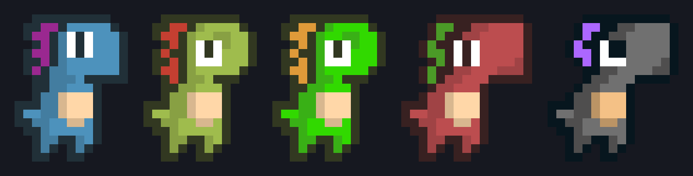
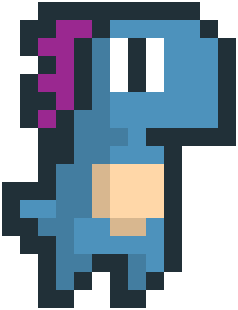
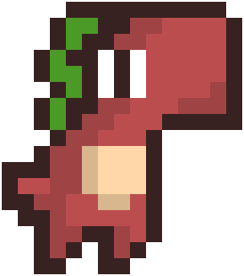
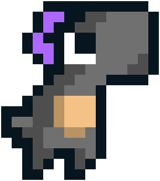
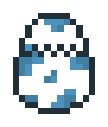
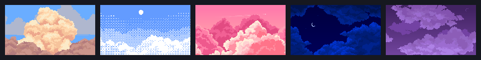

# Companion App

<p align="center">
  
</p>

<p align="center">
  <strong>Um companion virtual estilo Tamagotchi para o desktop</strong><br/>
  Popup pixel art que vive no canto da tela, reage a você,<br/>
  escuta a música que está tocando e conversa com personalidade.
</p>

<p align="center">
  macOS (Electron) + API Node local
</p>

---

## Os dinos

Cada personalidade do quiz nasce um dino diferente:

<p align="center">
  
</p>

| | | | | |
|:---:|:---:|:---:|:---:|:---:|
| <br/>**Doux**<br/>curioso | <br/>**Vita**<br/>carinhoso | <br/>**Olaf**<br/>preguiçoso | <br/>**Mort**<br/>zoeiro | <br/>**Kuro**<br/>misterioso |

<p align="center">
  <br/>
  <sub>Começa no ovo — o hatch só depois do quiz</sub>
</p>

---

## Céu por hora do dia

Amanhecer · dia · entardecer · noite · tempestade

<p align="center">
  
</p>

---

## O que ele faz

- **Quiz de personalidade** — responde umas perguntas e nasce um dino
- **Animações pixel** — idle, corrida, pulo, dash, poke, chat e nascimento do ovo
- **Céu dinâmico** — muda com a hora (+ clima do dia)
- **Spotify / Apple Music** — detecta a faixa (se o app já estiver aberto) e comenta
- **Tray + minimizar** — some pro tray e manda notificações personalizadas
- **Chat com LLM** — DeepSeek / NVIDIA → OpenRouter → voz local
- **Clima real** — temperatura da sua região (não inventa graus)
- **Build DMG** — app standalone com API embutida
- **iOS (SwiftUI)** — widget, lock screen e Dynamic Island (`apps/ios`)

Design: widget arredondado, dino à esquerda no céu, painel de ações à direita.

---

## Estrutura

```
companion-backend/
├── src/                 # API Express (mock local / LEGACY)
├── apps/desktop/        # Electron + sync Supabase
├── apps/ios/            # SwiftUI → Supabase direto

├── prisma/              # schema (opcional; mock sem DB)
├── apps/desktop/        # popup Electron
│   ├── electron/        # main / preload / Spotify
│   └── renderer/        # UI, sprites, sons, céus
├── apps/ios/            # app SwiftUI + Widget + Dynamic Island
├── scripts/             # prepare bundle, make-dmg, generate-ios
├── docs/preview/        # imagens do README
└── data/                # sessão local (gitignored)
```

---

## Setup

**Requisitos:** Node.js 20+, macOS (para o desktop + mídia).

```bash
git clone https://github.com/cauesilva1/Companion-App.git
cd Companion-App
npm install          # SEMPRE na raiz — nunca dentro de apps/desktop
cp .env.example .env
```

> Workspaces npm: existe **um** `package-lock.json` na raiz. Instalar de novo em `apps/desktop` baixa o Electron outra vez e pode parecer “loop de dependências” no Cursor.

Edite o `.env` com suas chaves (nunca commite esse arquivo):

| Variável | Onde pegar |
| --- | --- |
| `NVIDIA_API_KEY` | [build.nvidia.com](https://build.nvidia.com) |
| `OPENROUTER_API_KEY` | [openrouter.ai/keys](https://openrouter.ai/keys) |
| `HUGGINGFACE_API_KEY` | opcional |
| `DATABASE_URL` + `DIRECT_URL` | Supabase Postgres (migrations) |
| `SUPABASE_URL` + `SUPABASE_ANON_KEY` | Sync direto nos clients (Auth + REST) |

**Sem banco:** Express em mock JSON local.

**Sync PC ↔ iPhone:** configure Supabase nos clients (não precisa hospedar Express).
No desktop:

```bash
cp apps/desktop/.env.example apps/desktop/.env
# SUPABASE_URL=https://xxxx.supabase.co
# SUPABASE_ANON_KEY=eyJ...
# API_URL local só se quiser o mock Express embutido
```

---

## Cloud (sem Mac na LAN, sem Express hospedado)

Fluxo: **Supabase Auth + Postgres** direto nos clients (como Next).

1. No dashboard Supabase: Auth email/senha; rode `npx prisma migrate deploy` (RLS).
2. `.env`: `SUPABASE_URL` + `SUPABASE_ANON_KEY`, depois `node scripts/sync-supabase-config.mjs`.
3. iPhone / desktop: usuário só cria conta (email/senha).

Express (`npm run dev`) continua só para mock local no Mac — **não** precisa Railway/Fly para sync.

> Se a senha do banco vazou, troque no Supabase.
---

## Rodar

```bash
npm run dev
```

Sobe a API em `http://127.0.0.1:3333` e abre o Electron quando `/health` responder.

Só API:

```bash
npm run dev:api
```

---

## Build (app standalone no Mac)

Gera um `.app` / `.dmg` que **sobe a API sozinho** — no dia a dia você não precisa de `npm run dev`.

**Requisitos:** Node.js 20+, macOS, `.env` na raiz com as chaves da LLM (o script de prepare copia esse `.env` para o bundle, **sem** `DATABASE_URL`, modo mock).

```bash
npm install
cp .env.example .env   # se ainda não tiver; preencha as chaves
npm run dist:mac
```

Isso:

1. Compila a API e monta `apps/desktop/resources/api`
2. Gera o ícone (dino Mort) e empacota o Electron
3. Cria o DMG com `hdiutil`

**Saída:**

| Arquivo | Caminho |
| --- | --- |
| App | `apps/desktop/release/mac/Companion.app` |
| DMG | `apps/desktop/release/Companion-1.0.0-mac.dmg` |

**Usar o app:**

1. Abra o DMG (ou o `.app` direto)
2. Arraste **Companion** para Aplicativos (opcional)
3. Na primeira abertura: clique com o botão direito → **Abrir** (app sem assinatura Apple)
4. Dados locais ficam em `~/Library/Application Support/Companion/`

Para sync com o iPhone: mesma conta Supabase (`SUPABASE_URL` + anon key no `.env` do desktop e na Config do iOS). **Sem** API Express na nuvem.

Só a pasta do app (sem DMG):

```bash
npm run prepare:desktop
npm run build --workspace=companion-desktop
npm run pack --workspace=companion-desktop
```

---

## iOS (SwiftUI)

App nativo com **widget**, **tela de bloqueio** e **Dynamic Island**.  
Código em [`apps/ios/`](apps/ios/) — detalhes em [`apps/ios/README.md`](apps/ios/README.md).

**Modo padrão:** Supabase (conta email/senha) ou standalone local. **Não precisa de API Express na nuvem.**

- Now Playing (título/artista), missões, pegadinhas, 60 Hz no app
- LAN Mac só em **Config → Avançado**
**Requisitos:** macOS Sequoia 15+, **Xcode 26.3** Universal, iOS 16.2+.

```bash
./scripts/generate-ios-project.sh
open apps/ios/Companion.xcodeproj
```

---

## Modelos NVIDIA (cascata)

Ordem padrão (configurável em `NVIDIA_MODELS` / `NVIDIA_MODEL`):

1. `deepseek-ai/deepseek-v4-pro-0813` (primário)
2. um fallback da lista / OpenRouter
3. fala local se tudo falhar

Perguntas de clima usam localização (IP) + Open-Meteo e citam temperatura real da região.

---

## Atalhos e tray

- `Cmd+Shift+C` — mostra / esconde
- **−** / **×** — minimizar pro tray
- Clique no tray ou na notificação — volta
- Spotify: **Ajustes → Privacidade → Automação** (permitir controlar Spotify)

---

## API (resumo)

| Método | Rota | Uso |
| --- | --- | --- |
| `POST` | `/auth/register` | cria conta email/senha → JWT |
| `POST` | `/auth/login` | login → JWT |
| `GET` | `/auth/me` | usuário autenticado |
| `POST` | `/companion` | cria companion (Bearer) |
| `GET` | `/companion/me` | pet da conta |
| `GET` | `/companion/:id/state` | estado + humor |
| `POST` | `/companion/:id/interact` | Poke / Feed / Play / Chat / Tease |
| `GET` | `/companion/:id/feed` | histórico |
| `GET` | `/missions/today` | missões do dia |
| `POST` | `/missions/:id/claim` | resgata recompensa |
| `POST` | `/missions/open-app` | progresso “abrir app” |

Com `DATABASE_URL` as rotas companion/missions exigem `Authorization: Bearer <token>`. Sem DB = mock local sem auth.

---

## Créditos de arte / som

Ver [apps/desktop/ATTRIBUTION.md](apps/desktop/ATTRIBUTION.md):

- Dinos — [arks / Dino Characters](https://arks.itch.io/dino-characters)
- Céus — Craftpix / Free Game Assets
- SFX — Prehistoric Sound Pack

---

## Segurança

- `.env` está no `.gitignore` — **não** suba chaves reais
- Use só placeholders em `.env.example`
- Sessão local e `data/` também ficam fora do git
- `apps/desktop/resources/` e `apps/desktop/release/` (bundle/DMG) também ficam fora do git
- API escuta em `127.0.0.1` por padrão (`HOST=0.0.0.0` no Docker / LAN)
- Body JSON limitado a 32kb; `POST .../interact` tem rate limit básico
- Auth: email + senha (bcrypt) + JWT — sem Sign in with Apple/Google neste ciclo

Se uma chave ou senha do banco vazou, **revogue e gere outra**.

---

## Cursor / Windows: CPU alta ao abrir o repo

Sintoma típico: Cursor em 100% CPU e mensagem de “instalação de dependências em loop”.

Causas comuns neste monorepo:

1. **`npm install` na pasta errada** (`apps/desktop` além da raiz) → segundo download do Electron (~250MB+)
2. **Indexação** de `node_modules`, `release/`, `resources/` (centenas de MB / dezenas de milhares de arquivos)
3. Extensões órfãs do próprio Cursor (não é bug do repo) — limpar pasta de extensions ajuda

Mitigações já no repo:

- `.cursorignore` — Cursor não deve indexar builds/deps
- `.npmrc` + lockfile só na raiz
- `apps/desktop/package-lock.json` removido / ignorado

Para o amigo no Windows:

```bash
# na raiz do clone
rm -rf node_modules apps/desktop/node_modules
npm install
```

No Cursor: Settings → desativar auto-run de tasks se houver; não abrir a pasta `apps/desktop/release` como workspace.

---

## Licença

Projeto pessoal / experimental. Assets de terceiros seguem as licenças dos respectivos autores (ver ATTRIBUTION).
